# SeedSpinner - Password List Generator

SeedSpinner is a powerful and flexible password list generation tool designed for security professionals and researchers. It leverages both systematic mutation techniques and AI-powered brainstorming (via Azure OpenAI) to create comprehensive and contextually relevant wordlists for password strength testing and analysis.

**Disclaimer:**
This tool is intended for **educational purposes and authorized security testing only**. Using this tool to attempt unauthorized access to any system or account is illegal and unethical. Always obtain explicit, written permission before using this tool on any system you do not own. The developers assume no liability and are not responsible for any misuse or damage caused by this program.

### Inspiration for this tool came from the TV show Mr. Robot using the [elpscrk](https://github.com/D4Vinci/elpscrk) tool; and is the successor project to my [dissertation](https://github.com/tpazz/Password-Security-Gamification). 


## Features

*   **Seed Word Input:** Start with a list of base words relevant to your target.
*   **AI-Powered Brainstorming (Optional):**
    *   Integrates with Azure OpenAI (e.g., GPT models).
    *   Expands your initial seed words with related terms, concepts, nicknames, and common associations.
    *   Provides multiple prompt templates (concise, explanatory, creative) for tailored AI suggestions.
    *   User can review and filter AI-suggested words before they are used for mutation.
*   **Systematic Mutation Engine:**
    *   **Capitalisation:** Generates various capitalization patterns (e.g., `word`, `Word`, `WORD`).
    *   **Leet Speak:** Applies common character substitutions (e.g., `a` to `@` or `4`, `e` to `3`).
    *   **Concatenation:** Combines seed words and their variations in different orders.
    *   **Suffix/Prefix Addition (Affixes):** Appends and prepends common numbers, years, and symbols.
*   **Implicit Combination Logic:** Capitalisation and Leet Speak effects are automatically combined if both mutations are enabled, creating more complex variations.
*   **Controlled Affix Application:** Affixes are applied as a final step to fully formed single-word variations (post-Caps/Leet) and to fully formed concatenated strings.
*   **Interactive TUI (Terminal User Interface):**
    *   Menu-driven interface for easy configuration.
    *   Toggle mutation settings ON/OFF.
    *   Set Azure OpenAI endpoint, API key, model name, and system prompt file.
*   **Wordlist Estimation & Preview:**
    *   Provides an approximate calculation of the potential wordlist size (lines and file size) before generation.
    *   Shows a small preview of ~10-20 sample generated passwords.
    *   Calculates an approximate character entropy for the previewed sample.
*   **Memory-Safe Wordlist Generation**
    *   Memory-Safe Generation: Handles extremely large wordlists without crashing by streaming candidates to a temporary file, avoiding high RAM usage.
    *   Leverages System Utilities: Uses optimized command-line tools (sort, uniq) for efficient, disk-based deduplication and sorting of massive lists.

## Prerequisites

*   Python 3.x
*   If using AI brainstorming (optional):
    *   Your Azure OpenAI Endpoint URL.
    *   Your Azure OpenAI API Key.
    *   The Deployment Name of your model.

## Usage
  
 ```bash
 python tui.py
 ```

Core Logic Flow
---

```mermaid
graph TD
    A[Start: User provides Base Words & Mutation Config] --> B{Load Base Words};

    B --> C{For each Base Word};
    C --> D_InitForms[Initialize CoreForms = BaseWord];

    %% --- Single Word Core Variation Generation (Caps and/or Leet) ---
    D_InitForms --> E_Caps{Capitalisation ON?};
    E_Caps -- Yes --> F_ApplyCaps[Apply Capitalisation to CoreForms];
    F_ApplyCaps --> G_LeetCheck{Leet Speak ON?};
    E_Caps -- No --> G_LeetCheck;

    G_LeetCheck -- Yes --> H_ApplyLeet[Apply Leet Speak to CoreForms];
    H_ApplyLeet --> I_CoreVariationsDone[CoreForms now contain Caps/Leet variations];
    G_LeetCheck -- No --> I_CoreVariationsDone;

    I_CoreVariationsDone --> J_StoreForConcat[Store CoreForms for Concatenation Map];
    J_StoreForConcat --> K_AffixCheckSingle{Affixes ON?};

    K_AffixCheckSingle -- Yes --> L_ApplyAffixSingle[Apply Affixes to CoreForms];
    L_ApplyAffixSingle --> M_AddSingleToOutput[Add results from L_ApplyAffixSingle to Final Output Set];
    K_AffixCheckSingle -- No --> M_AddSingleToOutput[Add CoreForms no affixes to Final Output Set];

    M_AddSingleToOutput --> C_Loop_End;

    C_Loop_End -. All Base Words Processed for Single Forms .-> N_ConcatCheck;
    C --> C_Loop_End; 

    N_ConcatCheck{Concatenation ON?};
    N_ConcatCheck -- No --> Z[End: Final Output Set is the Wordlist];

    N_ConcatCheck -- Yes --> O_PrepConcat[Retrieve CoreForms for Concatenation from Map];
    O_PrepConcat --> P_LoopWord1{For each BaseWord1 from Map};
    P_LoopWord1 --> Q_LoopWord2{For each BaseWord2 from Map can be same as BaseWord1};
    
    Q_LoopWord2 --> R_GetForms[form1 = CoreForms_BaseWord1\nform2 = CoreForms_BaseWord2];
    R_GetForms --> S_IterateForms1{For each v1 in form1};
    S_IterateForms1 --> T_IterateForms2{For each v2 in form2};
    T_IterateForms2 --> U_Concatenate[ConcatenatedString = v1 + v2];

    U_Concatenate --> V_AffixCheckConcat{Affixes ON?};
    V_AffixCheckConcat -- Yes --> W_ApplyAffixConcat[Apply Affixes to ConcatenatedString];
    W_ApplyAffixConcat --> X_AddConcatToOutput[Add results from W_ApplyAffixConcat to Final Output Set];
    V_AffixCheckConcat -- No --> X_AddConcatToOutput[Add ConcatenatedString no affixes to Final Output Set];
    
    X_AddConcatToOutput --> T_IterateForms2; 
    T_IterateForms2 -- All v2 Processed --> S_IterateForms1;
    S_IterateForms1 -- All v1 Processed --> Q_LoopWord2;
    Q_Loop_End -- All BaseWords2 Processed --> P_LoopWord1;
    P_LoopWord1 -- All BaseWords1 Processed for Concat --> Z;

    Z[End: Final Output Set is the Wordlist];

    
    
```

