# SeedSpinner - Password List Generator

SeedSpinner is a powerful and flexible password list generation tool designed for security professionals and researchers. It leverages both systematic mutation techniques and AI-powered brainstorming (via Azure OpenAI) to create comprehensive and contextually relevant wordlists for password strength testing and analysis.

**Disclaimer:**
This tool is intended for **educational purposes and authorized security testing only**. Using this tool to attempt unauthorized access to any system or account is illegal and unethical. Always obtain explicit, written permission before using this tool on any system you do not own. The developers assume no liability and are not responsible for any misuse or damage caused by this program.

## Features

*   **Seed Word Input:** Start with a list of base words relevant to your target.
*   **AI-Powered Brainstorming (Optional):**
    *   Integrates with Azure OpenAI (e.g., GPT models).
    *   Expands your initial seed words with related terms, concepts, nicknames, and common associations.
    *   Provides multiple prompt templates (concise, explanatory, creative) for tailored AI suggestions.
    *   User can review and filter AI-suggested words before they are used for mutation.
*   **Systematic Mutation Engine:**
    *   **Capitalisation:** Generates various capitalization patterns (e.g., `word`, `Word`, `WORD`).
    *   **Leet Speak:** Applies common character substitutions (e.g., `a` to `@` or `4`, `e` to `3`).
    *   **Concatenation:** Combines seed words and their variations in different orders.
    *   **Suffix/Prefix Addition (Affixes):** Appends and prepends common numbers, years, and symbols.
*   **Implicit Combination Logic:** Capitalisation and Leet Speak effects are automatically combined if both mutations are enabled, creating more complex variations.
*   **Controlled Affix Application:** Affixes are applied as a final step to fully formed single-word variations (post-Caps/Leet) and to fully formed concatenated strings.
*   **Interactive TUI (Terminal User Interface):**
    *   Menu-driven interface for easy configuration.
    *   Toggle mutation settings ON/OFF.
    *   Set Azure OpenAI endpoint, API key, model name, and system prompt file.
*   **Wordlist Estimation & Preview:**
    *   Provides an approximate calculation of the potential wordlist size (lines and file size) before generation.
    *   Shows a small preview of ~10-20 sample generated passwords.
    *   Calculates an approximate character entropy for the previewed sample.
*   **Post-Generation Analysis:**
    *   Calculates and displays character distribution entropy for the final generated wordlist.
    *   Displays the "list entropy" (log2 of the number of unique passwords generated).

## How the Generation Logic Works (Simplified)

1.  **Seed Words:** You provide initial words.
2.  **AI Brainstorming (Optional):** Azure OpenAI suggests related terms. You filter these to create an expanded list of base words.
3.  **For each Base Word (Single Word Variations):**
    *   **Core Variations:** The base word undergoes Capitalisation and/or Leet Speak. If both are enabled, Leet Speak is applied to capitalized forms.
    *   **Affix Application:** If Affixes are enabled, they are applied to these "Core Variations."
    *   These fully mutated single words are added to the final list.
4.  **Concatenation (If Enabled):**
    *   Uses the "Core Variations" (Caps/Leet forms, *before* single-word affixes were applied to them) of each base word as components.
    *   Combines components from every ordered pair of base words (e.g., `CoreVar(WordA) + CoreVar(WordB)`).
    *   **Affix Application:** If Affixes are enabled, they are applied to these newly formed concatenated strings.
    *   These fully mutated concatenated words are added to the final list.
5.  **Output:** All unique generated passwords are saved to a file.

## Prerequisites

*   Python 3.x
*   `openai` Python library (`pip install openai`)
*   An active Azure OpenAI account and resource with a deployed model (e.g., GPT-3.5-turbo, GPT-4). You will need:
    *   Your Azure OpenAI Endpoint URL.
    *   Your Azure OpenAI API Key.
    *   The Deployment Name of your model.

## Setup & Usage

1.  **Clone/Download:** Get the `tui.py` and `ai_agent.py` (and any prompt files like `prompt_concise.txt`) into the same directory.
2.  **Install Dependencies:**

    ```bash
    pip install openai
    ```
4.  **Prepare Prompt Files (Optional but Recommended for AI):**
    *   Create text files for your system prompts (e.g., `prompt_concise.txt`, `prompt_explanatory.txt`). Examples have been provided during development.
5.  **Run the Tool:**

    ```bash
    python tui.py
    ```
7.  **Follow the TUI Menu:**
    *   **1. Set Azure Endpoint & Key:** Enter your Azure OpenAI credentials. The client will attempt to initialize.
    *   **2. Set System Prompt File:** Specify the path to your desired system prompt file for AI brainstorming (e.g., `prompt_concise.txt`).
    *   **3. Set AI Model Name:** Enter your Azure OpenAI model deployment name.
    *   **4. Enter/Edit Seed Words:** Input your comma-separated base words (e.g., `companyname, product, location2024`).
    *   **5. Run AI Brainstorming:** If steps 1-4 are configured, this will call the AI to expand your seed words.
    *   **6. Review/Filter AI Suggestions:** Select which of the (seed + AI-suggested) words you want to use for generation.
    *   **7. Configure Mutations:** Toggle Capitalisation, Leet Speak, Concatenation, and Affixes ON or OFF.
    *   **8. Estimate List Size:** Get an estimate of lines, file size, and a preview of generated words + preview entropy.
    *   **9. Set Output Filename:** Specify the name for your wordlist file (default: `wordlist.txt`).
    *   **10. GENERATE WORDLIST:** Start the main generation process.
    *   **11. Exit:** Close the application.

## Example Workflow (Without AI)

1.  Run `python tui.py`.
2.  Select **4. Enter/Edit Seed Words** -> enter `service, admin, 2023`
3.  Select **7. Configure Mutations** -> enable Capitalisation, Affixes.
4.  Select **8. Estimate List Size** -> review the preview and estimate.
5.  Select **9. Set Output Filename** -> enter `my_simple_list.txt`
6.  Select **10. GENERATE WORDLIST**.

## Example Workflow (With AI)

1.  Run `python tui.py`.
2.  Select **1. Set Azure Endpoint & Key** -> enter your details.
3.  Select **2. Set System Prompt File** -> enter `prompt_creative.txt` (assuming you have it).
4.  Select **3. Set AI Model Name** -> enter your deployment name.
5.  Select **4. Enter/Edit Seed Words** -> enter `targetcorp, projectX`
6.  Select **5. Run AI Brainstorming**.
7.  Select **6. Review/Filter AI Suggestions** -> refine the list of words from AI.
8.  Select **7. Configure Mutations** -> enable Capitalisation, Leet Speak, Concatenation, Affixes.
9.  Select **8. Estimate List Size**.
10. Select **10. GENERATE WORDLIST**.

## Interpreting Entropy Values

*   **Character Distribution Entropy (of Preview / Final List):**
    *   Measures the average information content (uncertainty) per character *within the generated passwords*.
    *   A higher value (e.g., closer to 4-6 bits/char) suggests more character variety (uppercase, lowercase, numbers, symbols) and a more even distribution of those characters.
    *   This is an indicator of the *character complexity* of the list, not a direct measure of overall password strength.
*   **List Entropy (log2 of unique passwords in the final list):**
    *   Indicates the size of your generated password set in bits.
    *   If an attacker knew your password was *definitely* from this list and could test optimally, this is related to the number of guesses.
    *   **This is NOT the average password strength against general guessing attacks.** It only applies if the attack is constrained to this specific list.

## Future Enhancements (Ideas)

*   More sophisticated Leet Speak rule engine.
*   User-configurable affix lists (numbers, symbols, common words, dates).
*   Additional mutation types (reversal, character repetition, keyboard shifts, etc.).
*   Option to define password length constraints or character set requirements.
*   More advanced memory management for generating extremely large lists (e.g., disk-based processing).
*   GUI instead of TUI.

Core Logic Flow
---

```mermaid
graph TD
    A[Start: User provides Base Words & Mutation Config] --> B{Load Base Words};

    B --> C{For each Base Word};
    C --> D_InitForms[Initialize CoreForms = BaseWord];

    %% --- Single Word Core Variation Generation (Caps and/or Leet) ---
    D_InitForms --> E_Caps{Capitalisation ON?};
    E_Caps -- Yes --> F_ApplyCaps[Apply Capitalisation to CoreForms];
    F_ApplyCaps --> G_LeetCheck{Leet Speak ON?};
    E_Caps -- No --> G_LeetCheck;

    G_LeetCheck -- Yes --> H_ApplyLeet[Apply Leet Speak to CoreForms];
    H_ApplyLeet --> I_CoreVariationsDone[CoreForms now contain Caps/Leet variations];
    G_LeetCheck -- No --> I_CoreVariationsDone;

    I_CoreVariationsDone --> J_StoreForConcat[Store CoreForms for Concatenation Map];
    J_StoreForConcat --> K_AffixCheckSingle{Affixes ON?};

    K_AffixCheckSingle -- Yes --> L_ApplyAffixSingle[Apply Affixes to CoreForms];
    L_ApplyAffixSingle --> M_AddSingleToOutput[Add results from L_ApplyAffixSingle to Final Output Set];
    K_AffixCheckSingle -- No --> M_AddSingleToOutput[Add CoreForms no affixes to Final Output Set];

    M_AddSingleToOutput --> C_Loop_End;

    C_Loop_End -. All Base Words Processed for Single Forms .-> N_ConcatCheck;
    C --> C_Loop_End; 

    N_ConcatCheck{Concatenation ON?};
    N_ConcatCheck -- No --> Z[End: Final Output Set is the Wordlist];

    N_ConcatCheck -- Yes --> O_PrepConcat[Retrieve CoreForms for Concatenation from Map];
    O_PrepConcat --> P_LoopWord1{For each BaseWord1 from Map};
    P_LoopWord1 --> Q_LoopWord2{For each BaseWord2 from Map can be same as BaseWord1};
    
    Q_LoopWord2 --> R_GetForms[form1 = CoreForms_BaseWord1\nform2 = CoreForms_BaseWord2];
    R_GetForms --> S_IterateForms1{For each v1 in form1};
    S_IterateForms1 --> T_IterateForms2{For each v2 in form2};
    T_IterateForms2 --> U_Concatenate[ConcatenatedString = v1 + v2];

    U_Concatenate --> V_AffixCheckConcat{Affixes ON?};
    V_AffixCheckConcat -- Yes --> W_ApplyAffixConcat[Apply Affixes to ConcatenatedString];
    W_ApplyAffixConcat --> X_AddConcatToOutput[Add results from W_ApplyAffixConcat to Final Output Set];
    V_AffixCheckConcat -- No --> X_AddConcatToOutput[Add ConcatenatedString no affixes to Final Output Set];
    
    X_AddConcatToOutput --> T_IterateForms2; 
    T_IterateForms2 -- All v2 Processed --> S_IterateForms1;
    S_IterateForms1 -- All v1 Processed --> Q_LoopWord2;
    Q_Loop_End -- All BaseWords2 Processed --> P_LoopWord1;
    P_LoopWord1 -- All BaseWords1 Processed for Concat --> Z;

    Z[End: Final Output Set is the Wordlist];

    
    
```

